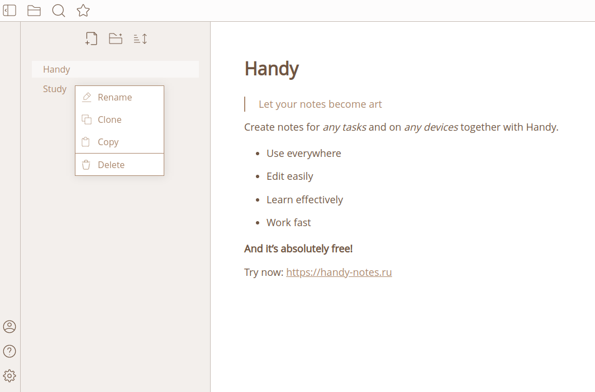

<div align="center">
  
  <h1>Handy</h1>
  <h4>Let your notes become art ✨</h4>
</div>

<div align="center">

[](https://gitlab.com/zavod-team/handy) [](https://gitlab.com/zavod-team/handy/-/project_members) [](https://handy-notes.ru)

</div>

<div align="center">
  <p>Handy is a website for creating notes. We have done everything to make your notes and our code look like a work of art.</p>
  
</div>


## Features
### JWT authentication 🔐
We are aware of how important the security of users' personal data is, so authentication in our application is based on [JWT](https://jwt.io/introduction) tokens. This approach is considered one of the safest ways to transmit information .

### Markdown notes editor 📝
[Markdown](https://en.wikipedia.org/wiki/Markdown) is a markup language for text documents. Today it is the most convenient language for text formatting, which is why we decided to use it for editing notes.
Our editor supports:
- Headings (up to 6 levels)
- Text formatting (bold, italic)
- Quotes
- Lists (ordered and not)
- Links

### Synchronization (beta) 🔄
Since Handy was originally supposed to be a multiplatform application, we decided to implement support for syncing notes. To correctly combine the edited text with its old version, we used a simplified version of the Operational Transformation ([OT](https://en.wikipedia.org/wiki/Operational_transformation)) algorithm . Now users can edit notes simultaneously from two devices!

## Technologies
<table>
<tr>
  <th>Client</th>
  <th>Server</th>
  <th>Deploy</th>
</tr>
<tr>
  <td>
    
  </td>
  <td>
    
  </td>
  <td>
    
  </td>
</tr>
</table>

## Getting started
### Prerequisites
To run the project locally, it is recommended to install the following.

**For client:**
* [Node.js](https://nodejs.org/ru/blog/release/v18.12.0) 18.12+
* [npm](https://docs.npmjs.com/downloading-and-installing-node-js-and-npm) (usually comes with Node.js)

**For server:**
* [JDK](https://openjdk.org/projects/jdk/17/) 17
* [Gradle](https://docs.gradle.org/current/userguide/installation.html) 7+
* [MySQL](https://dev.mysql.com/downloads/installer/) 8+

It is also necessary to install [Docker Compose](https://docs.docker.com/compose/install/) to simplify the process of building the application.

### Installation
1. Clone the repository
   ```
   git clone https://gitlab.com/zavod-team/handy.git
   ```
2. Create a file .env in the root of the project (next to docker-compose.yml)
   ```
   LOGS_DIR=../logs
   BUILD_DIR=./server
   DB_DIR=../db
   LETSENCRYPT_DIR=../letsencrypt

   MYSQL_DATABASE=database
   MYSQL_USER=user
   MYSQL_PASSWORD=password
   MYSQL_ROOT_PASSWORD=root
   MYSQL_HOST=host
   MYSQL_PORT=port
   ```
3. Change in docker-compose.yml the following sections
   ```
   backend:
    build: ./server
    restart: always
    env_file:
      - .env
    depends_on:
      - db
    ports:
      - 8080:8080

   frontend:
    build: ./client
    env_file:
      - .env
    volumes:
    - ${BUILD_DIR}:/server
   ```
4. *Optional*. For a separate client launch install npm
dependencies outside of Docker
   ```
   cd ./client
   npm install
   ```

### Run
**Fullstack (with Docker)**
1. Build client
   ```
   docker-compose build frondend
   docker-compose up frondend
   ```
2. Build server
   ```
   docker-compose build backend
   ```
3. Run it all together
   ```
   docker-compose up db backend
   ```
The Handy website should be available at `localhost:8080`.

It is important to up the client and server containers in this order, because the client leaves artifacts in the server resources folder, and the server image is already being built with them.

After each client rebuild, all commands must be executed.

**Client**

If necessary, the client can be run separately. There are two ways to do this.
1. Build mode:
   ```
   npm run build
   ```
   As a result, a bundle will appear in the `client/build` folder.
2. Development mode:
   ```
   npm run start
   ```
   The website will be available at `localhost:4200`.

## Links
[](https://gitlab.com/zavod-team/handy) [](https://github.com/PeachMood/handy) [](https://www.figma.com/file/B9IIHIQdR9ngrWCTkL2EM8/Handy-%2F-Website?type=design&node-id=0%3A1&mode=design&t=lW4apHOKlNYxAh4E-1)
